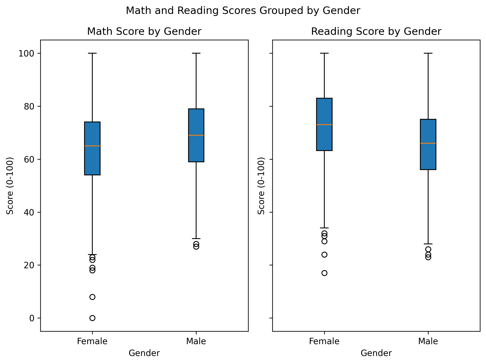
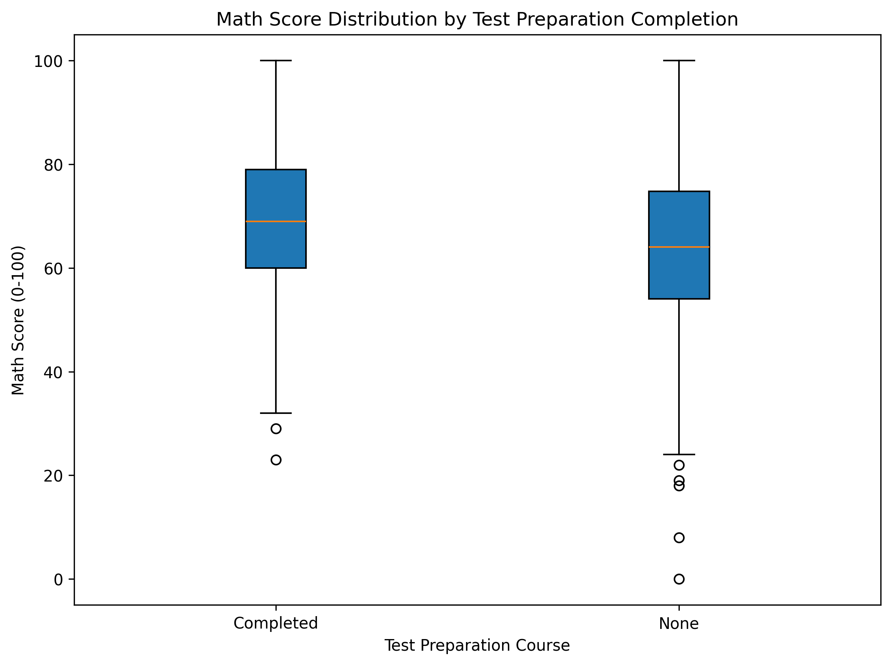
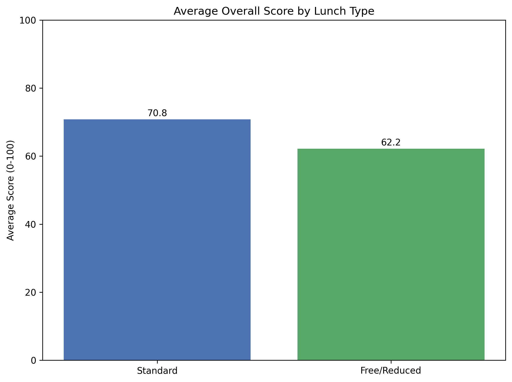
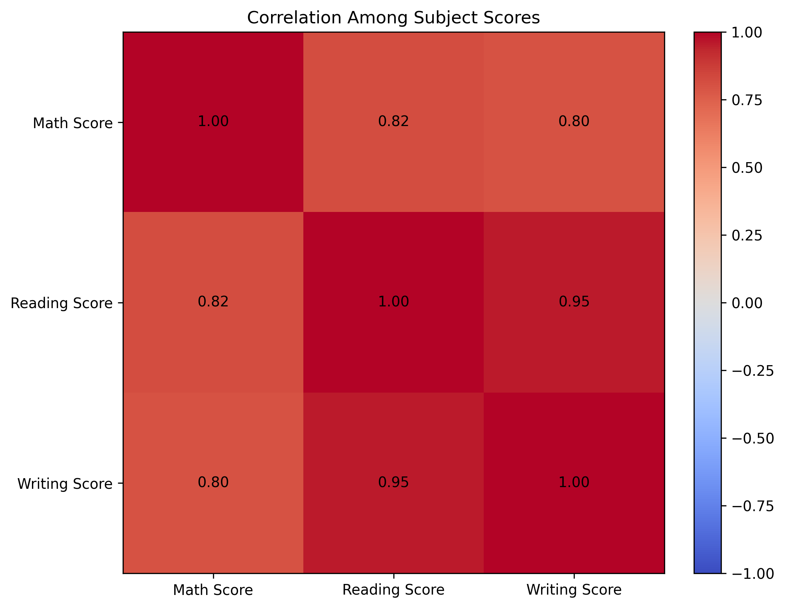
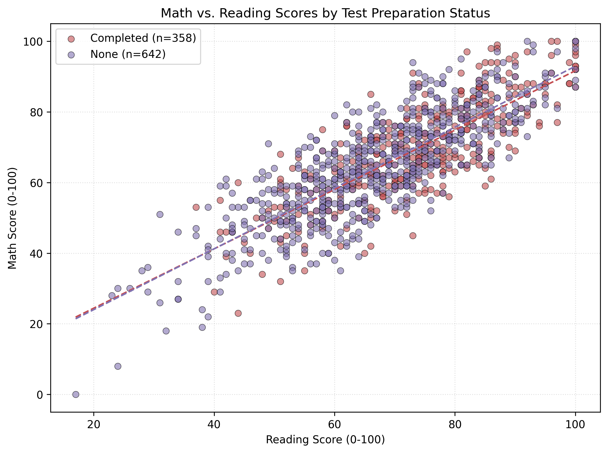

## Student Performance Analysis
The analysis ingests the raw Kaggle StudentsPerformance dataset, drops records with missing core fields, and engineers an overall average score by combining math, reading, and writing. These cleaned data feed the visualization stages, ensuring each plot reflects consistent cohorts across gender, lunch status, and test preparation participation.

### V1: Gender Score Distribution

Female students post a median math score of 65.0 and a reading median of 73.0, while males center around 69.0 in math and 66.0 in reading. Female math scores span an interquartile range from 54.0 to 74.0, closely matching the male range of 59.0 to 79.0. Reading boxplots show female upper quartile performance reaching 83.0 versus 75.0 for males, highlighting a literacy edge. Male math distribution dips to a minimum of 27 compared with the female minimum of 0, illustrating more low-end male outliers. Together the boxplots show modest gender gaps that consistently favor female readers and slightly steadier female math outcomes.

### V2: Test Preparation and Math Outcomes

Students who completed test preparation achieve an average math score of 69.7, about 5.6 points above those without preparation. The median advantage is similar at 5.0 points, and the completed group shows a higher lower-quartile threshold in the boxplot. Score dispersion tightens for prepared students, suggesting the course lifts the floor as well as the ceiling. A few low outliers remain among non-participants, hinting at students who may benefit most from intervention. Overall the visual underscores a meaningful math payoff from the preparation course.

### V3: Lunch Type and Overall Average

Standard-lunch students average 70.8 across subjects, compared with 62.2 for the subsidized cohort. The gap of roughly 8.6 points persists despite shared assessments, signalling socioeconomic effects on performance. The bars also highlight how no lunch group approaches the 90-point benchmark, leaving room for enrichment. Free/reduced lunch students cluster closer to the 70s, indicating greater support needs. Prioritizing resources for subsidized lunch participants could shrink the observed average deficit.

### V4: Subject Correlation Heatmap

Math and reading exhibit a strong positive correlation of 0.82, while writing aligns closely with reading at 0.95. Math and writing also reinforce each other with a coefficient of 0.80. The near-diagonal symmetry confirms consistent inter-subject relationships across the cohort. No negative associations appear, so gains in one domain likely spill into others. This tight triad suggests integrated literacy and numeracy strategies may amplify outcomes across all exams.

### V5: Math vs Reading with Trend Lines

Both preparation groups follow upward trends, with completed students gaining 0.84 math points per reading point versus 0.86 for non-participants. Prepared students cluster higher across the plane, rarely dropping below 60 in math when reading scores exceed 70. Non-prepared students show broader scatter and more cases dipping under the regression line, hinting at inconsistent math follow-through. Legends reveal 358 prepared students versus 642 without preparation, so the uplift is supported by sizable samples. Diverging regression lines reinforce the earlier boxplot story: test preparation elevates math results for comparable reading levels.
